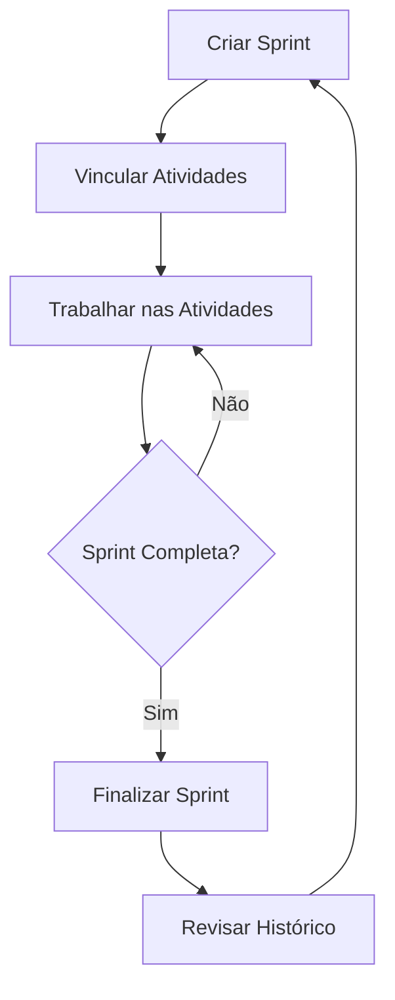

# 📋 Guia de Implementação do Sistema de Sprints

## ✅ Resumo da Implementação

O sistema de Sprints foi completamente refatorado e implementado com integração ao Supabase, substituindo o armazenamento em localStorage por uma solução robusta e escalável.

---

## 🎯 Funcionalidades Implementadas

### 1. **Gestão de Sprints**
- ✅ Criar e iniciar uma Sprint
- ✅ Visualizar todas as Sprints (ativas e finalizadas)
- ✅ Finalizar Sprint com registro automático de datas
- ✅ Excluir Sprints (apenas as finalizadas)
- ✅ Validação: apenas uma Sprint pode estar "em andamento" por vez

### 2. **Gestão de Atividades**
- ✅ Vincular atividades a uma Sprint
- ✅ Desvincular atividades de uma Sprint
- ✅ Visualizar atividades por Sprint
- ✅ Interface intuitiva no modal de detalhes da atividade

### 3. **Visualização e Relatórios**
- ✅ Cards de Sprint com informações resumidas
- ✅ Modal de detalhes da Sprint com estatísticas
- ✅ Progresso visual (barra de progresso)
- ✅ Distribuição de atividades por status
- ✅ Informações de datas de início e fim

### 4. **Sincronização em Tempo Real**
- ✅ Atualização automática via Supabase Realtime
- ✅ Mudanças refletidas instantaneamente em todos os clientes

---

## 🗃️ Estrutura do Banco de Dados

### Tabela: `sprints`

```sql
CREATE TABLE public.sprints (
  id UUID PRIMARY KEY DEFAULT gen_random_uuid(),
  owner_id UUID NOT NULL REFERENCES auth.users(id),
  nome TEXT NOT NULL,
  data_inicio TIMESTAMP WITH TIME ZONE DEFAULT now(),
  data_fim TIMESTAMP WITH TIME ZONE,
  status TEXT DEFAULT 'em_andamento' CHECK (status IN ('em_andamento', 'finalizada')),
  company_id UUID REFERENCES public.companies(id),
  created_at TIMESTAMP WITH TIME ZONE DEFAULT now(),
  updated_at TIMESTAMP WITH TIME ZONE DEFAULT now()
);
```

### Tabela: `activities` (campo adicionado)

```sql
ALTER TABLE public.activities
  ADD COLUMN sprint_id UUID REFERENCES public.sprints(id) ON DELETE SET NULL;
```

### Políticas RLS (Row Level Security)

- ✅ Usuários podem ver apenas suas próprias sprints
- ✅ Usuários podem criar suas próprias sprints
- ✅ Usuários podem atualizar suas próprias sprints
- ✅ Usuários podem deletar suas próprias sprints

---

## 📁 Arquivos Criados/Modificados

### Novos Arquivos

1. **`supabase/migrations/20250115000000_add_sprint_support.sql`**
   - Migração completa do banco de dados
   - Adiciona suporte a Sprints
   - Configura RLS e índices

2. **`frontend/src/hooks/useSupabaseSprints.ts`**
   - Hook React para gerenciar Sprints
   - Funções: criar, finalizar, deletar, vincular atividades
   - Realtime subscriptions

3. **`apply_sprint_migration.js`**
   - Script para aplicar a migração no Supabase
   - Validação e logs detalhados

### Arquivos Modificados

1. **`frontend/src/components/SprintTracker.tsx`**
   - Refatorado para usar Supabase
   - Interface aprimorada com diálogos
   - Botão "Iniciar Sprint" com validações

2. **`frontend/src/components/SprintDetails.tsx`**
   - Integrado com Supabase
   - Exibe atividades vinculadas
   - Estatísticas em tempo real

3. **`frontend/src/components/ActivityViewModal.tsx`**
   - Adicionada seção "Gestão de Sprint"
   - Select para vincular/desvincular atividades
   - Exibição de informações da Sprint vinculada

---

## 🚀 Como Aplicar a Migração

### Opção 1: Usar o Script Node.js

```bash
node apply_sprint_migration.js
```

### Opção 2: Executar SQL Manualmente

1. Acesse o Supabase Dashboard
2. Vá em SQL Editor
3. Copie e execute o conteúdo de `supabase/migrations/20250115000000_add_sprint_support.sql`

---

## 🧪 Como Testar o Sistema de Sprints

### 1. **Criar uma Sprint**

1. Acesse a página **Planejador** (`/activities`)
2. Na seção "Acompanhamento de Sprints", clique em **"Iniciar Sprint"**
3. Digite um nome para a Sprint (ex: "Sprint 1 - Desenvolvimento")
4. Clique em **"Iniciar Sprint"**

**Validação esperada:**
- ✅ Sprint criada com status "Em Andamento"
- ✅ Não é possível criar outra Sprint enquanto houver uma ativa
- ✅ Toast de confirmação exibido

### 2. **Vincular Atividades à Sprint**

1. Clique em qualquer atividade para abrir o modal de detalhes
2. Na seção **"Gestão de Sprint"**, selecione a Sprint ativa
3. A atividade será vinculada automaticamente

**Validação esperada:**
- ✅ Atividade vinculada com sucesso
- ✅ Toast de confirmação
- ✅ Informações da Sprint exibidas no modal

### 3. **Visualizar Detalhes da Sprint**

1. Na seção "Acompanhamento de Sprints", clique no card da Sprint
2. Modal de detalhes será aberto

**Validação esperada:**
- ✅ Nome e datas da Sprint
- ✅ Progresso geral (concluídas/total)
- ✅ Distribuição por status
- ✅ Lista de atividades vinculadas

### 4. **Finalizar a Sprint**

1. No card da Sprint ativa, clique em **"Finalizar Sprint"**
2. Confirme a ação

**Validação esperada:**
- ✅ Sprint marcada como "Finalizada"
- ✅ Data de fim registrada automaticamente
- ✅ Todas as atividades e seus status salvos
- ✅ Toast de confirmação

### 5. **Visualizar Histórico**

1. Sprints finalizadas aparecem nos cards com badge verde
2. Clique para ver detalhes e atividades da Sprint finalizada

**Validação esperada:**
- ✅ Informações históricas preservadas
- ✅ Atividades exibidas com status no momento da finalização

### 6. **Desvincular Atividade**

1. Abra uma atividade vinculada a uma Sprint
2. Na seção "Gestão de Sprint", selecione **"Nenhuma sprint"**

**Validação esperada:**
- ✅ Atividade desvinculada
- ✅ Toast de confirmação

### 7. **Excluir Sprint**

1. No card de uma Sprint **finalizada**, clique no ícone de 3 pontos (⋮)
2. Selecione **"Excluir"**
3. Confirme a ação

**Validação esperada:**
- ✅ Sprint excluída do banco de dados
- ✅ Atividades desvinculadas automaticamente
- ✅ Não é possível excluir Sprint em andamento

---

## 🔄 Sincronização em Tempo Real

O sistema utiliza **Supabase Realtime** para sincronizar mudanças:

- ✅ Quando uma Sprint é criada, todos os usuários veem instantaneamente
- ✅ Quando uma Sprint é finalizada, atualiza em tempo real
- ✅ Quando atividades são vinculadas, reflete imediatamente

---

## 🛡️ Regras de Negócio Implementadas

1. **Uma Sprint Ativa por Vez**
   - Apenas uma Sprint pode ter status "em_andamento"
   - Ao criar nova Sprint, sistema valida se já existe uma ativa

2. **Proteção de Dados**
   - RLS garante isolamento entre usuários
   - Cada usuário vê apenas suas próprias Sprints

3. **Integridade Referencial**
   - Ao excluir Sprint, atividades são desvinculadas (ON DELETE SET NULL)
   - Ao excluir usuário, suas Sprints são removidas

4. **Auditoria**
   - Todas as Sprints têm `created_at` e `updated_at`
   - Histórico completo de atividades preservado

---

## 📊 Fluxo de Trabalho Recomendado



---

## 🐛 Troubleshooting

### Problema: Migração falhou

**Solução:**
1. Verifique se as credenciais do Supabase estão corretas
2. Execute os comandos SQL manualmente no Supabase Dashboard
3. Verifique logs de erro no console

### Problema: Sprints não aparecem

**Solução:**
1. Verifique se o usuário está autenticado
2. Verifique as políticas RLS no Supabase
3. Abra o console do navegador e veja erros

### Problema: Realtime não funciona

**Solução:**
1. Verifique se o Realtime está habilitado no Supabase
2. Recarregue a página
3. Verifique a conexão de internet

---

## 🎨 Componentes UI Utilizados

- **Card**: Exibição dos cards de Sprint
- **Badge**: Status (Em Andamento, Finalizada)
- **Progress**: Barra de progresso
- **Dialog**: Modal de criação de Sprint
- **Select**: Vincular atividades
- **Button**: Ações (Iniciar, Finalizar, Excluir)
- **Toast**: Notificações

---

## 📝 Próximas Melhorias (Opcional)

- [ ] Adicionar filtros por data de Sprint
- [ ] Exportar relatório de Sprint em PDF
- [ ] Gráficos de performance por Sprint
- [ ] Integração com calendário
- [ ] Notificações por email ao finalizar Sprint

---

## 🎉 Conclusão

O sistema de Sprints está completamente funcional e integrado ao Supabase!

**Benefícios:**
- ✅ Persistência de dados confiável
- ✅ Sincronização em tempo real
- ✅ Escalável e performático
- ✅ Interface intuitiva
- ✅ Código bem estruturado e manutenível

Para qualquer dúvida ou problema, consulte este guia ou entre em contato com a equipe de desenvolvimento.

